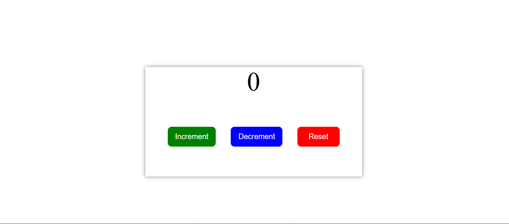

# React Counter App

This is a simple counter application built using **React JS**. It allows users to increment, decrement, and reset a counter using buttons.

## Features

- ✅ Increment the counter
- ✅ Decrement the counter (won’t go below 0)
- ✅ Reset the counter to 0


## 📸 Screenshot



## How to Run

1. Install dependencies:
   ```bash
   npm install
